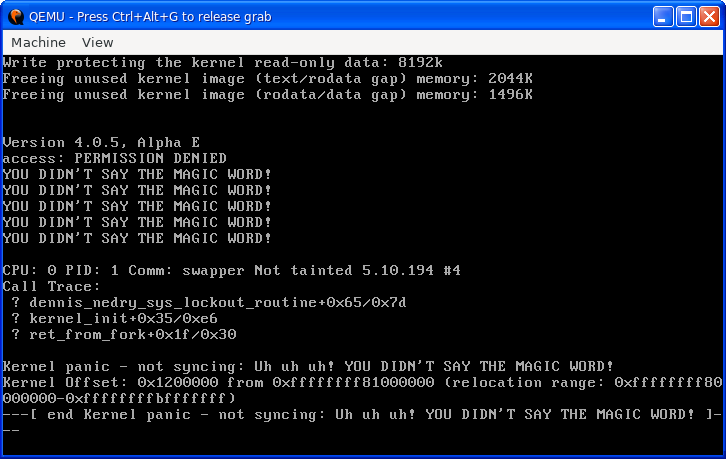

This is a small patch to the linux-5.10.194 kernel that triggers a kernel panic that reads "Uh uh uh! YOU DIDN'T SAY THE MAGIC WORD!" solely for gag screenshots. 

Why? Because it's funny.

Obviously, this kernel doesn't boot. Though you could, if you wanted, add a thing that checks the kernel command line for "please" or something, but then you won't get the gag messaging, so why would you even wanna do that? <small>I may have seriously considered it.</small>

Went ahead and included a config that should work with most EFI-ready machines if you wanna run it on real hardware.

Try it out in qemu after build with qemu:

```
qemu-system-x86_64 -kernel arch/x86/boot/bzImage
```


